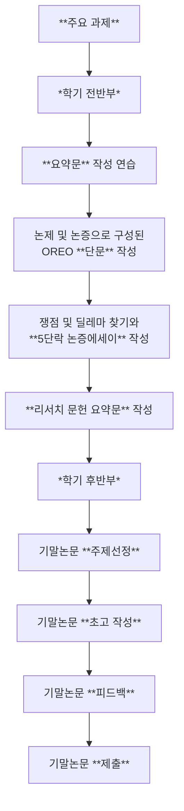

```mermaid
flowchart TB
   M[**주요 과제**] --> Z[*학기 전반부*] --> A[**요약문** 작성 연습] --> B[논제 및 논증으로 구성된 <br> OREO **단문** 작성] --> C[쟁점 및 딜레마 찾기와 <br> **5단락 논증에세이** 작성] --> D[**리서치 문헌 요약문** 작성] --> E[*학기 후반부*] --> F[기말논문 **주제선정**] --> G[기말논문 **초고 작성**] --> H[기말논문 **피드백**] --> I[기말논문 **제출**]
```