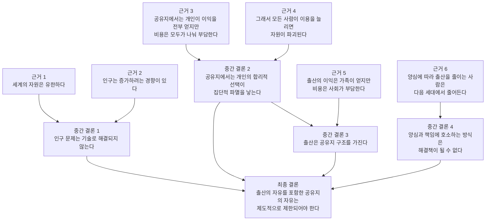

---
title: 논증구조 Map
layout: home
nav_order: 52
parent: 논제와 논증 구조 분석
permalink: /references/Hardin/Arguments/Argument_Map/
---

# Garrett Hardin, *The Tragedy of the Commons*

## Argument Map (논증 구조)



---

## 1단계: 최종 결론

맨 위의 결론

> **공유지 문제는 자유에 맡겨두면 해결되지 않으므로
> 제도적 규칙과 제한이 필요하다**

특히 하딘은

> **출산의 자유를 제한해야 한다**

라는 강한 결론을 제시합니다.

---

## 2단계: 네 가지 핵심 이유

이 결론을 위해 하딘은 **네 가지 중간 결론**을 제시합니다.

### (1) 인구 문제는 기술로 해결되지 않는다

이유

* 세계는 유한
* 인구는 증가

---

### (2) 공유지에서는 개인의 합리성이 파멸을 낳는다

예

* 공동 목초지
* 바다 어업
* 국립공원

개인의 계산

```id="34j4pn"
내 이익 > 내가 부담하는 비용
```

하지만

```id="1gxtsx"
모두가 그렇게 하면
→ 자원 파괴
```

---

### (3) 출산도 공유지 구조다

아이를 낳으면

* 이익 → 가족
* 비용 → 사회

따라서 공유지와 같은 구조가 됩니다.

---

### (4) 양심에 맡기면 해결되지 않는다

양심적인 사람만 출산을 줄이면

→ 다음 세대에서 양심적인 사람 비율 감소

---

## 3단계: 최종 결론

그래서 하딘은 말합니다.

> **자유로운 선택만으로는 문제를 해결할 수 없다.**

따라서

> **사회는 규칙과 제도를 통해 공유지를 관리해야 한다.**

그는 이를

**“mutual coercion mutually agreed upon”**

즉

> **모두가 동의한 강제 규칙**

이라고 부릅니다.

---

# 학습 질문

1️⃣ 하딘의 핵심 전제는 무엇인가?
2️⃣ “공유지”라는 개념은 왜 중요한가?
3️⃣ 개인의 합리성이 왜 사회적 비합리성을 낳는가?
4️⃣ 하딘의 결론은 너무 강한가?

---

