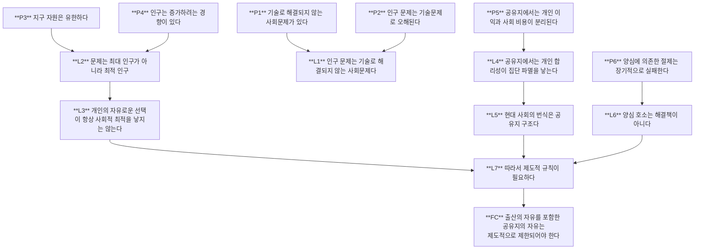

---
title: 논제와 논증 구조 분석
layout: home
nav_order: 50
parent: 하딘의 공유지의 비극
permalink: /references/Hardin/Arguments/
---

# (논증구조 분석) 공유지의 비극(The Tragedy of the Commons)

### 표기

- **P**: Premise (전제)
- **L**: Lemma (보조 정리)
- **FC**: Final Conclusion (최종 결론)

---

## Premises (전제)

**P1**
일부 사회문제는 기술만으로 해결할 수 없다.

**P2**
인구 문제는 일반적으로 기술로 해결 가능한 문제로 오해된다.

**P3**
지구의 자원은 실질적으로 유한하다.

**P4**
인구는 자연적으로 증가하려는 경향이 있다.

**P5**
공유지에서는 개인의 이익과 사회적 비용이 분리된다.

**P6**
양심에 의존한 자발적 절제는 장기적으로 실패한다.

---

## Lemmas (보조 정리)

**L1**
인구 문제는 **기술로 해결되지 않는 사회문제** 이다.

(P1 + P2)

---

**L2**
인구 문제는 **최대 인구가 아니라 최적 인구 문제**이다.

(P3 + P4)

---

**L3**
개인의 자유로운 선택이 항상 사회적 최적을 낳는 것은 아니다.

(L2)

---

**L4**
공유지에서는 개인의 합리적 선택이 집단적 파멸을 낳는다.

(P5)

(= Hardin의 핵심 정리)

---

**L5**
현대 사회에서 번식은 공유지 구조를 갖는다.

(L4)

---

**L6**
양심이나 책임에 대한 호소는 인구 문제의 해결책이 아니다.

(P6)

---

**L7**
따라서 인구 문제 해결에는 **제도적 규칙**이 필요하다.

(L3 + L5 + L6)

---

# Final Conclusion

**FC**

> 사회는 공유지의 비극을 피하기 위해
> **출산의 자유를 포함한 공유지의 자유를 제도적으로 제한해야 한다.**

(Hardin의 "상호 합의된 상호 강제(mutual coercion mutually agreed upon)")

---

# Argument Map

---

