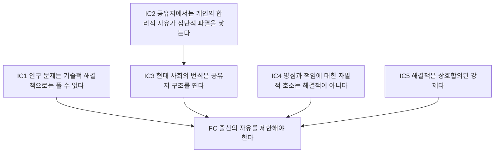
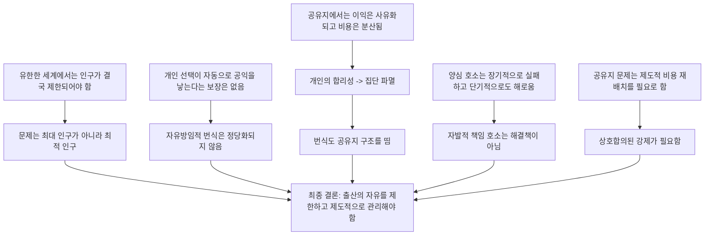

# (논증구조 분석) 공유지의 비극(The Tragedy of the Commons)

## 분석 원칙

- **원문의 절 순서**를 최대한 유지한다.
- **직접 결론으로 가는 주논증**과 **옆에서 보강하는 보조논증**을 구분한다.
- 각 연결이
  - 비교적 직접적인 추론인지,
  - 유비/일반화인지,
  - 규범적 가교를 필요로 하는지
  를 드러낸다.

### 표기법

- **FC**: Final Conclusion (최종 결론)
- **IC**: Intermediate Conclusion (중간 결론)
- **P**: Premise (전제)
- **[D]**: 비교적 직접적인 추론
- **[A]**: 유비 또는 경험적 일반화
- **[N]**: 규범적 가교

### 최종 결론

**FC.**
과잉인구의 비극을 피하고 다른 더 소중한 자유를 보존하려면, 사회는 **출산의 자유를 포기 또는 제한**하고, 그 대신 **상호합의된 강제(mutual coercion mutually agreed upon)** 를 통해 번식을 제도적으로 관리해야 한다.

---

## 1. 주논증의 큰 흐름

이 도식은 `map`의 간결함을 유지하되, 실제 논증의 핵심 가지를 `summary`에 맞춰 정밀화한 것이다.

---

## 2. 절별 통합 논증구조

## I. No technical solution problem -> 인구 문제는 기술 문제가 아니다

### P1.
어떤 인간 문제들은 기술만 바꿔서는 해결되지 않는다.

### P2.
기술적 해결책이란 자연과학적 기술만 바꾸고 인간의 가치, 도덕, 제도는 그대로 두는 해결책이다.

### P3.
인구 문제는 보통 “현재의 자유와 특권을 유지한 채 기술로 해결될 수 있는 문제”로 이해된다.

### P4.
그러나 인구 문제는 그런 방식으로는 풀리지 않는다.

**P1-P4 [D] -> IC1.**
**IC1.** 인구 문제는 **no technical solution problem** 이다.

### 보충 설명
여기서 핵심은 “기술이 쓸모없다”가 아니라, **기술만으로는 부족하고 인간의 권리/자유/제도에 대한 재조정이 필요하다**는 점이다.

---

## II. What Shall We Maximize? -> 문제는 '최대 인구'가 아니라 '최적 인구'다

### P5.
세계는 실천적으로 유한하다고 가정해야 한다.

### P6.
유한한 세계는 유한한 인구만 지탱할 수 있다.

### P7.
따라서 인구 증가는 결국 0이 되어야 한다.

**P5-P7 [D] -> IC2.**
**IC2.** 인구는 결국 안정 상태에 도달해야 한다.

### P8.
“가장 많은 사람 수”와 “가장 큰 선”은 동시에 최대화할 수 없다.

### P9.
인구를 극대화하려면 1인당 소비, 여가, 예술, 문화 등 인간적 선을 줄여야 한다.

**P8-P9 [D] -> IC3.**
**IC3.** 최대 인구는 최대 선과 양립하지 않는다.

### P10.
그러므로 목표는 인구의 최대화가 아니라 어떤 **최적점(optimum)** 의 탐색이어야 한다.

**IC2 + IC3 [D] -> IC4.**
**IC4.** 문제는 **최대 인구**가 아니라 **최적 인구**다.

### P11.
최적 인구를 찾으려면 서로 다른 가치들(자연, 산업, 여가, 미적 가치 등)에 가중치를 부여해야 한다.

### P12.
그러한 가중치는 자동으로 주어지지 않으며, 사회적 판단을 필요로 한다.

**P11 + P12 [D] -> IC5.**
**IC5.** 인구 문제는 기술 계산이 아니라 **가치판단과 사회적 선택**을 필요로 한다.

---

## III. 애덤 스미스적 자유방임에 대한 반박 준비 -> 개인 결정이 자동으로 최적점을 만들지 않는다

### P13.
만약 각 개인의 번식 결정이 자동으로 공익을 산출한다면, 자유방임적 번식 정책도 정당화될 수 있다.

### P14.
이 생각이 바로 인구 영역에서의 “보이지 않는 손” 가정이다.

### P15.
그러나 공유지에서는 개인의 사익 추구가 자동으로 공익을 산출하지 않는다.

**P13-P15 [D] -> IC6.**
**IC6.** 인구 문제를 개인의 자유방임적 선택에 맡길 수는 없다.

---

## IV. Tragedy of Freedom in a Commons -> 공유지에서는 자유가 파멸을 낳는다

### P16.
공유지에서는 추가 이용의 이익은 주로 행위자 개인에게 돌아간다.

### P17.
추가 이용의 비용은 모든 사용자에게 분산된다.

### P18.
합리적 행위자는 자신에게 순이익이 남는 한 이용을 늘리려 한다.

**P16-P18 [D] -> IC7.**
**IC7.** 공유지의 각 개인은 이용 확대 유인을 갖는다.

### P19.
모든 사람이 같은 계산에 따라 이용을 확대하면 총부하는 한계를 넘어선다.

### P20.
한계를 넘은 공유지는 파괴된다.

**IC7 + P19 + P20 [D] -> IC8.**
**IC8.** 공유지에서는 개인의 합리성이 집단의 파멸을 낳는다.

### IC9.
즉, **“Freedom in a commons brings ruin to all.”**

**IC8 [D] -> IC9.**

---

## V. Pollution / National Parks -> 공유지 비극은 일반 구조다

### P21.
오염은 공유지에서 무언가를 가져가는 대신, 무언가를 버리는 경우일 뿐 구조는 동일하다.

### P22.
오염 처리 비용은 행위자에게 집중되지만, 오염의 피해는 사회 전체로 분산된다.

**P21 + P22 [A] -> IC10.**
**IC10.** 오염도 공유지 비극의 한 형태다.

### P23.
국립공원, 해양, 목초지 등도 같은 구조를 보인다.

**IC9 + IC10 + P23 [A] -> IC11.**
**IC11.** 공유지 비극은 목초지 하나의 사례가 아니라 **일반적 사회구조**다.

---

## VI. How to Legislate Temperance? -> 복잡한 사회에서는 상황-민감적 규제가 필요하다

### P24.
행위의 도덕성은 그 행위가 이루어지는 시스템 상태에 의존한다.

### P25.
인구밀도가 낮을 때 허용되던 행위도 밀도가 높아지면 해롭다.

**P24 + P25 [D] -> IC12.**
**IC12.** 현대의 조밀한 사회에서는 단순한 절대명령만으로는 문제를 다스릴 수 없다.

### P26.
따라서 세부 조건에 대응하는 행정적, 제도적 장치가 필요하다.

### P27.
다만 그러한 장치는 감시자에 대한 감시와 피드백을 필요로 한다.

**IC12 + P26 + P27 [D] -> IC13.**
**IC13.** 공유지 문제의 해결은 **상황-민감적 제도 설계**를 필요로 한다.

> 이 절은 최종 결론으로 곧장 가지는 않지만, 뒤의 “mutual coercion” 절에서 왜 단순 도덕 설교가 아니라 제도적 강제가 필요하다고 보는지를 받쳐 준다.

---

## VII. Freedom to Breed Is Intolerable -> 번식은 공유지 구조를 띤다

### P28.
가족이 자기 자원에만 의존하고 과잉출산의 비용을 전적으로 스스로 부담한다면, 번식은 공적 문제가 아닐 수 있다.

### P29.
그러나 하딘이 전제하는 사회는 복지국가이며, 추가 출산의 비용 일부가 사회 전체로 분산된다.

### P30.
반면 출산의 편익은 주로 가족, 집단, 계급, 종교집단 등에 귀속된다.

**P28-P30 [A] -> IC14.**
**IC14.** 현대 사회의 번식은 공유지 구조를 띤다.

### IC9.
공유지의 자유는 모두의 파멸을 낳는다.

### IC14.
번식은 공유지 구조를 띤다.

**IC9 + IC14 [D] -> IC15.**
**IC15.** **출산의 자유는 파멸을 낳는다.**

---

## VIII. Conscience Is Self-Eliminating / Pathogenic Effects of Conscience -> 양심 호소는 실패한다

### P31.
양심에 따라 번식을 자제하는 사람과 그렇지 않은 사람은 다르게 행동한다.

### P32.
더 많이 번식하는 집단이 다음 세대에서 비중을 늘린다.

**P31 + P32 [D] -> IC16.**
**IC16.** 양심 호소는 장기적으로 자기소멸적이다.

### P33.
양심에 호소하는 방식은 “자제하지 않으면 비난하겠다”와 “자제하면 손해 보는 바보가 된다”는 이중구속을 만든다.

### P34.
이러한 방식은 불안과 병리적 효과를 낳는다.

**P33 + P34 [D] -> IC17.**
**IC17.** 양심 호소는 단기적으로도 해롭다.

### IC18.
따라서 책임 있는 부모 됨, 책임 있는 시민 됨 같은 **순수한 자발적 도덕 호소는 해결책이 아니다.**

**IC16 + IC17 [D] -> IC18.**

---

## IX. Mutual Coercion Mutually Agreed Upon -> 해결은 제도화된 강제다

### P35.
실질적 책임은 선전이 아니라 일정한 사회적 배열에서 생긴다.

### P36.
공유지 비극을 막으려면 개인이 사익을 계산할 때 공적 비용도 함께 계산되도록 제도를 바꿔야 한다.

**P35 + P36 [D] -> IC19.**
**IC19.** 공유지 문제는 제도적 강제를 필요로 한다.

### P37.
그 강제는 전면 금지일 수도 있지만, 세금, 사용료, 할당, 허가, 차등 비용처럼 “편향된 선택지”의 형태일 수도 있다.

### P38.
이런 장치는 자발적 선의보다 무양심적 행위자를 더 잘 통제한다.

**P37 + P38 [D] -> IC20.**
**IC20.** 필요한 것은 단순 금지가 아니라 **설계된 강제 장치**다.

### P39.
현실의 제도는 완전하지 않을 수 있다.

### P40.
그러나 공유지의 총파멸보다 불완전한 제도가 낫다.

**P39 + P40 [N] -> IC21.**
**IC21.** 불완전한 제도라도 채택 정당성이 있을 수 있다.

### IC22.
따라서 해결책은 **상호합의된 강제(mutual coercion mutually agreed upon)** 이다.

**IC19 + IC20 + IC21 [D/N] -> IC22.**

---

## X. Recognition of Necessity -> 자유의 재정의와 최종 결론

### P41.
인구가 낮을 때는 허용되던 공유지가, 인구 증가와 함께 여러 영역에서 폐지되어 왔다.

### P42.
새로운 공유지 폐지는 개인 자유의 제한처럼 보이지만, 실제로는 파멸을 피하게 함으로써 더 큰 자유를 가능하게 한다.

### P43.
따라서 자유는 무제한 선택이 아니라 “필연성의 인식” 속에서 재정의되어야 한다.

**P41-P43 [N] -> IC23.**
**IC23.** 더 중요한 자유를 보존하려면 어떤 자유는 포기되어야 한다.

### IC1.
인구 문제는 기술로 풀 수 없다.

### IC15.
출산의 자유는 파멸을 낳는다.

### IC18.
양심 호소는 해결책이 아니다.

### IC22.
해결책은 상호합의된 강제다.

### IC23.
어떤 자유는 더 큰 자유를 위해 포기되어야 한다.

**IC1 + IC15 + IC18 + IC22 + IC23 [D/N] -> FC.**
**FC.** 과잉인구의 비극을 피하고 다른 더 소중한 자유를 보존하려면, 사회는 **출산의 자유를 포기 또는 제한**하고, 그 대신 **상호합의된 강제**를 통해 번식을 관리해야 한다.

---

## 3. 수업용 초압축 Argument Map

---
